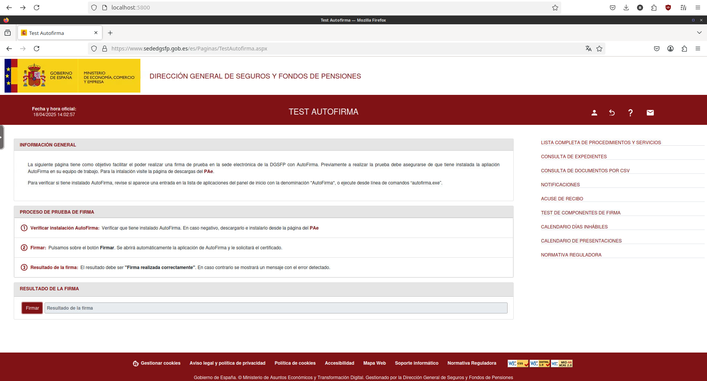

# About
This container runs a remote sandboxed environment with firefox and autofirma. It can be accessed with any web browser.

# Usage
+ `./run.sh`
+ Access from any web browser at http://localhost:5800

+ If you need any certificates inside the autofirma environment, copy them inside the `certificates/` folder. They'll be available inside the container in `/config/certificates/` (`Home/certificates` in the integrated file picker).
+ For your convenience, you may use the `documents/` folder to copy any files to sign & retrieve the signed result.
+ If you need to run any application inside the virtual environment (like running autofirma with CLI arguments), you may access the container's shell using `./shell.sh`. Any GUI window that may spawn from your commands will also appear inside the remote desktop's view.

# Motivation
Autofirma is required by many Spanish government websites for online operations, but its design raises several security concerns:
+ It has a messy and unstructured and hard-to-audit code structure with over 50 classes in the root directory.
+ It patches the client's web browser with javascript
+ They do not provide reproducible builds nor hashes for its built binaries
+ The built binary is downloaded from a website with a non-trusted HTTPS certificate controlled by the spanish government itself which has been known in the past to enable sketchy MITM operations
+ And many other concerns

This setup minimizes risk by running inside a container, instead of in your host machine.

It can also be used to sign documents from within an organization without sharing keys, in a centralized UI. Keep in mind, it should be secured behind a private network,and proper security practices should be performed.

# Requirements
+ `docker` https://docs.docker.com/engine/install/
+ `docker-compose-plugin`

---
# TODO:
+ [ ] Pre-add exception for Autofirma root certificate, since it attempts a connection to a local wss socket, causing errors in some (not all!) signing websites! See ctt-gob-es/clienteafirma/issues/167
This is one of the websites that requires it: https://sede.carm.es/cryptoApplet/ayuda/probarautofirma.html
+ [ ] Auto-setup certificates both in autofirma and in firefox (2 at once in the system store). Add CLI.
+ [ ] Change favicon
+ [ ] custom home screen, custom bookmarks
